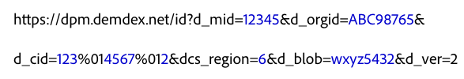

# Direct integration with the Experience Cloud Identity Service {#direct-integration-with-the-experience-cloud-id-service}

This implementation lets customers use the ID service on devices that cannot accept or work with our JavaScript or SDK code. This includes devices such as gaming consoles, smart TVs, or other Internet-enabled appliances. Refer to this section for syntax, code samples, and definitions.

## Syntax {#section-a4754afec5ad40b6be00d6f1011d68bb}

Devices that cannot use the VisitorAPI.js or SDK code libraries can make calls directly to the data collection servers (DCS) used by the ID service. To do this, you would call `dpm.demdex.net` and format your request as shown below. *Italics* indicates a variable placeholder.


In this syntax example, the `d_` prefix identifies the key-value pairs in the call as a system-level variable. You can pass quite a few `d_` parameters to the ID service, but stay focused on the key-value pairs as shown in the code above. For more information about other variables, see [Supported Attributes for DCS API calls](https://docs.adobe.com/content/help/en/audience-manager/user-guide/api-and-sdk-code/dcs/dcs-api-reference/dcs-keys.html).

The ID service supports HTTP and HTTPS calls. Use HTTPS to pass data from a secure page.

## Sample request {#section-26302b8851704888b6f8e6b2071bcdb0}

Your request could look similar to the sample shown below. Long variables have been shortened.



## Sample response {#section-89bc103b3e9e4a8b98e74c32897b1200}

The ID service returns data in a JSON object as shown below. Your response may be different.

```js
{
     "d_mid":"12345",
     "dcs_region":"6",
     "id_sync_ttl":"604800",
     "d_blob":"wxyz5432"
}
```

## Request and response parameters defined {#section-4a9912b545364dc4acad4f1ea5ec641d}

**Request Parameters**

<table id="table_C8FFA89AB74E4E31A6926CDE5CD54217"> 
 <thead> 
  <tr> 
   <th colname="col1" class="entry"> Parameter </th> 
   <th colname="col2" class="entry"> Description </th> 
  </tr> 
 </thead>
 <tbody> 
  <tr> 
   <td colname="col1"> <p> <span class="codeph"> dpm.demdex.net</span> </p> </td> 
   <td colname="col2"> <p>A legacy domain controlled by <span class="keyword"> Adobe</span>. See <a href="https://docs.adobe.com/content/help/en/audience-manager/user-guide/reference/demdex-calls.html" format="https" scope="external"> Understanding Calls to the Demdex Domain</a>. </p> </td> 
  </tr> 
  <tr> 
   <td colname="col1"> <p> <span class="codeph"> d_mid</span> </p> </td> 
   <td colname="col2"> <p>The Experience Cloud visitor ID. See <a href="../introduction/cookies.md" format="dita" scope="local"> Cookies and the Experience Cloud Identity Service</a>. </p> </td> 
  </tr> 
  <tr> 
   <td colname="col1"> <p> <span class="codeph"> d_orgid</span> </p> </td> 
   <td colname="col2"> <p>Your Experience Cloud Organization ID. For help with finding this ID see, <a href="../reference/requirements.md" format="dita" scope="local"> Requirements for the Experience Cloud Identity Service</a>. </p> </td> 
  </tr> 
  <tr> 
   <td colname="col1"> <p> <span class="codeph"> d_cid</span> </p> </td> 
   <td colname="col2"> <p>An optional parameter that passes the Data Provider ID (DPID), the Unique User ID (DPUUID), and an <a href="../reference/authenticated-state.md" format="dita" scope="local"> authenticated state ID</a> to the ID service. As shown in the code sample, separate the DPID and DPUUID with the non-printing control character, <span class="codeph"> %01</span>. </p> <p> <b>DPID and DPUUID</b> </p> <p>In the <span class="codeph"> d_cid</span> parameter, assign each related DPID and DPUUID combination to the same <span class="codeph"> d_cid</span> parameter. This lets you return multiple ID sets in a single request. Also, separate the DPID, DPUUID, and optional authentication flag with the non-printing control character, <span class="codeph"> %01</span>. In the examples below, the provider and user IDs are highlighted in <b>bold</b> text. </p> 
    <ul id="ul_2E19D837296B40E9ACD096495CF711C5"> 
     <li id="li_5B94B057654440B99B989BA60E4ED053">Syntax: <span class="codeph">...d_cid=DPID%01DPUUID%01authentication state...</span> </li> 
     <li id="li_B07833EF51D54F088574B7B7F9FB841A">Example: <span class="codeph">...d_cid=123%01456%011...</span> </li> 
    </ul> <p> <b>Authentication State</b> </p> <p>This is an optional ID in the <span class="codeph"> d_cid</span> parameter. Expressed as an integer, it identifies users according to their authentication status as shown below: </p> 
    <ul id="ul_E2B36922B11C4AA2A9016B6E2DC9EDAA"> 
     <li id="li_31C018E3F9514B938C73EF40C436715F"> <span class="codeph"> 0</span> (Unknown) </li> 
     <li id="li_1F125C3879324C2F8EF4613C0ECB5F02"> <span class="codeph"> 1</span> (Authenticated) </li> 
     <li id="li_EF6792D0115D407485079D5D7480D965"> <span class="codeph"> 2</span> (Logged out) </li> 
    </ul> <p>To specify an authentication state, you set this flag after the user ID (UUID) variable. Separate the UUID and authentication flag with the non-printing control character, <span class="codeph"> %01</span>. In the examples below, the authentication IDs are highlighted in <b>bold</b> text. </p> <p>Syntax: <span class="codeph">...d_cid=DPID%01DPUUID%01authentication state</span> </p> <p>Examples: </p> 
    <ul id="ul_4C1054CE860A4D9C8DD85C2A8020C47F"> 
     <li id="li_AD4000BF3E0146C0BD37B1EC513EC314">Unknown: <span class="codeph">...d_cid=123%01456%010...</span> </li> 
     <li id="li_B037D424AADA4D41BF29381A9602AE61">Authenticated: <span class="codeph">...d_cid=123%01456%011...</span> </li> 
     <li id="li_0410FCB9E60D4DD08E7898D814E1C3C9">Logged out: <span class="codeph">...d_cid=123%01456%012...</span> </li> 
    </ul> </td> 
  </tr> 
  <tr> 
   <td colname="col1"> <p> <span class="codeph"> dcs_region</span> </p> </td> 
   <td colname="col2"> <p>The ID service is a geographically distributed and load-balanced system. The ID identifies the region of the data center handling the call. See <a href="https://docs.adobe.com/content/help/en/audience-manager/user-guide/api-and-sdk-code/dcs/dcs-api-reference/dcs-regions.html" format="https" scope="external"> DCS Region IDs, Locations, and Host Names</a>. </p> </td> 
  </tr> 
  <tr> 
   <td colname="col1"> <p> <span class="codeph"> d_cb</span> </p> </td> 
   <td colname="col2"> <p> <i>(Optional)</i> A callback parameter that lets you execute a JavaScript function in the request body. </p> </td> 
  </tr> 
  <tr> 
   <td colname="col1"> <p> <span class="codeph"> d_blob</span> </p> </td> 
   <td colname="col2"> <p>An encrypted chunk of JavaScript metadata. Size constraints limit the blob to 512 bytes or less. </p> </td> 
  </tr> 
  <tr> 
   <td colname="col1"> <p> <span class="codeph"> d_ver</span> </p> </td> 
   <td colname="col2"> <p>Required. This sets the API version number. Leave this set as <span class="codeph"> d_ver=2</span>. </p> </td> 
  </tr> 
 </tbody> 
</table>

**Response Parameters**

Some response parameters are part of the request and have been defined in the section above.

<table id="table_58D0E8876DDC4A81B1F24F845E87EC18"> 
 <thead> 
  <tr> 
   <th colname="col1" class="entry"> Parameter </th> 
   <th colname="col2" class="entry"> Description </th> 
  </tr> 
 </thead>
 <tbody> 
  <tr> 
   <td colname="col1"> <p> <span class="codeph"> id_sync_ttl</span> </p> </td> 
   <td colname="col2"> <p>The re-synchronization interval, specified in seconds. The default interval is 604,800 seconds (7-days). </p> </td> 
  </tr> 
 </tbody> 
</table>
