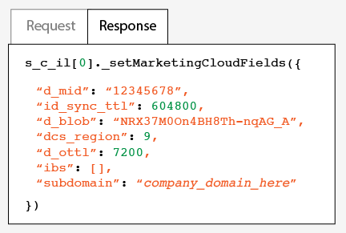

# Test and verify the Experience Cloud ID Service{#test-and-verify-the-experience-cloud-id-service}

These instructions, tools, and procedures help you determine if the ID service is working properly. These tests apply to the ID service in general and for different ID service and Experience Cloud solution combinations.

## Before you begin {#section-b1e76ad552ed4eb793b6e521a55127d4}

Important information to know before you begin testing and verifying the ID Service.

**Browser environments**

When testing in a normal browser session, clear your browser cache before each test.

Alternatively, you can test the ID service in an anonymous or incognito browser session. In an anonymous session, you don't need to clear your browser cookies or cache before each test.

**Tools**

The [Adobe debugger](https://marketing.adobe.com/resources/help/en_US/sc/implement/debugger.html) and the [Charles HTTP proxy](https://www.charlesproxy.com/) can help you determine if the ID service has been configured to work properly with Analytics. The information in this section based on the results returned by the Adobe debugger and Charles. However, you should feel free to use whatever tool or debugger works best for you.

## Testing with the Adobe Debugger {#section-861365abc24b498e925b3837ea81d469}

Your service integration is configured properly when you see a [!DNL Experience Cloud ID] (MID) in the [!DNL Adobe] debugger response. See [Cookies and the Experience Cloud ID Service](../introduction/mcvid-cookies.md) for more information about the MID.

To verify the status of the ID service with the [!DNL Adobe] [debugger](https://marketing.adobe.com/resources/help/en_US/sc/implement/debugger.html):

1. Clear your browser cookies or open an anonymous browsing session. 
1. Load your test page that contains ID service code. 
1. Open the [!DNL Adobe] debugger. 
1. Check the results for a MID.

## Understanding Adobe Debugger results {#section-bd2caa6643d54d41a476d747b41e7e25}

The MID is stored in a key-value pair that uses this syntax: `MID= *`Experience Cloud ID`*`. The debugger displays this information as shown below.

**Success**

The ID service has been implemented properly if you see a response that looks similar to this:

```
mid=20265673158980419722735089753036633573
```

If you're an [!DNL Analytics] customer, you may see an [!DNL Analytics] ID (AID) in addition to the MID. This happens:

* With some of your early/long-time site visitors. 
* If you have a grace period enabled.

**Failure**

Contact [customer care](https://helpx.adobe.com/marketing-cloud/contact-support.html) if the debugger:

* Does not return a MID. 
* Returns an error message that indicates your partner ID has not been provisioned.

## Testing with the Charles HTTP proxy {#section-d9e91f24984146b2b527fe059d7c9355}

To verify the status of the ID service with Charles:

1. Clear your browser cookies or open an anonymous browsing session. 
1. Start Charles. 
1. Load your test page that contains ID service code. 
1. Check for the request and response calls and data described below.

## Understanding Charles results {#section-c10c3dc0bb9945cbaffcf6fec7082fab}

Refer to this section for information about where to look, and what to look for, when you use Charles to monitor HTTP calls.

**Successful ID Service requests in Charles**

Your ID service code is working properly when the `Visitor.getInstance` function makes a JavaScript call to `dpm.demdex.net`. A successful request includes your [Organization ID](../reference/mcvid-requirements.md#section-a02f537129a64ffbb690d5738d360c26). The Organization ID is passed as a key-value pair that uses this syntax: `d_orgid= *`organization ID`*`. Look for the `dpm.demdex.net` and the JavaScript calls under the [!DNL Structure] tab. Look for your Organization ID under the [!DNL Request] tab.


**Successful ID Service responses in Charles**

Your account has been provisioned correctly for the ID service when the response from the [Data Collection Servers](https://marketing.adobe.com/resources/help/en_US/aam/c_compcollect.html) (DCS) return a MID. The MID is returned as a key-value pair that uses this syntax: `d_mid: *`visitor Experience Cloud ID`*`. Look for the MID in the [!DNL Response] tab as shown below.



**Failed ID Service responses in Charles**

Your account has not been provisioned correctly if the MID is missing from the DCS response. An unsuccessful response returns an error code and message in the [!DNL Response] tab as shown below. Contact customer care if you see this error message in the DCS response.


For more information about error codes, see [DCS Error Codes, Messages, and Examples](https://marketing.adobe.com/resources/help/en_US/aam/dcs_error_codes.html). 
