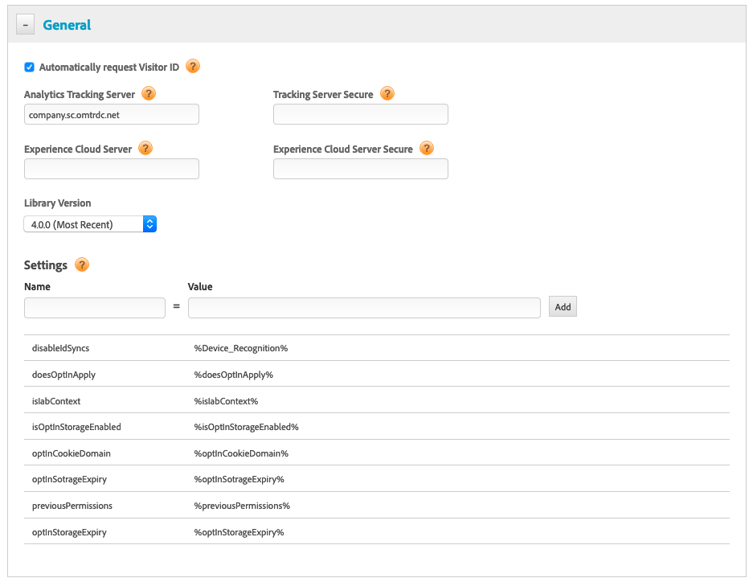

# Configuring Opt-in with DTM{#configuring-opt-in-with-dtm}

Enable Opt-in services using Dynamic Tag Management (DTM).

Set up Opt-in services using DTM.

Required:

* Upgrade to ECID 4.0.0 or later. See [ECID Download](https://github.com/Adobe-Marketing-Cloud/id-service/releases).

Enter [configuration fields](/help/implementation-guides/opt-in-service/api.md) in the General DTM page.

