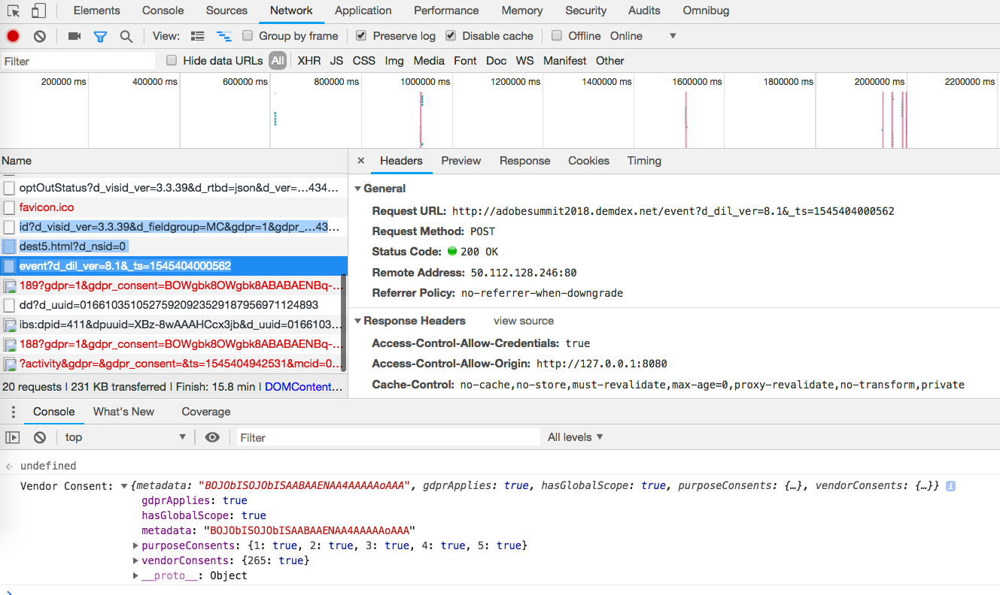

# Validating Opt-in Service{#validating-opt-in-service}

Once you have enabled Opt-in on your website, use the validation methods to test that the service is working as expected using the developer tools in your browser.

## Use case 1: Enable Opt-in {#section-c8fe1ee3711b420c8186c7057abbecb3}

```
Visitor.getInstance({{YOUR_ORG_ID}}, { 
    doesOptInApply: true 
});
```


Before loading the page, clear your cache and cookies.

In Chrome, right-click on the web page and select Inspect. As in the screenshot above, select the *Network* tab to view the requests made from the browser.

In the example above, we have the following Adobe JS tags installed on the page: ECID, AAM, Analytics and Target.

**How to prove that Opt-in is working as expected:**

You should not see any requests to Adobe servers:

* demdex.net/id 
* demdex.net/event 
* omtrdc.net/b/ss 
* omtrdc.net/m2 
* everesttech.net

>[!NOTE]
>
>You might see a call to `http://dpm.demdex.net/optOutStatus`, which is a READ ONLY endpoint that is used to retrieve the visitor's Opt-out status. This endpoint will not result in any third-party cookies being created, and will not collect any information from the page.

You should not see any cookies created by the Adobe tags: (AMCV_{{YOUR_ORG_ID}}, mbox, demdex, s_cc, s_sq, everest_g_v2, everest_session_v2)

In Chrome, go to the *Application* tab, expand the *Cookies* section under *Storage*, and select the domain name of your website:


## Use case 2: Enable Opt-in and Storage {#section-bd28326f52474fa09a2addca23ccdc0f}

```
Visitor.getInstance({{YOUR_ORG_ID}}, { 
    doesOptInApply: true, 
    isOptInStorageEnabled: true 
});
```

The only difference in use case 2 is that you will see *a new cookie* that will contain the Opt-in permissions provided by your visitor: **adobeujs-optin**

## Use case 3: Enable Opt-in and pre-approve Adobe Analytics {#section-257fe582b425496cbf986d0ec12d3692}

```
var preApproveAnalytics = {}; 
preApproveAnalytics[adobe.OptInCategories.ANALYTICS] = true;

Visitor.getInstance({{YOUR_ORG_ID}}, { 
    doesOptInApply: true, 
    preOptInApprovals: preApproveAnalytics 
});
```

Since Adobe Analytics is pre Opt-in approved, you will see requests in the Network tab to your tracking server:


and you will see Analytics cookies in the Application tab:


## Use case 4: Enable Opt-in and IAB {#section-64331998954d4892960dcecd744a6d88}

```
Visitor.getInstance({{YOUR_ORG_ID}}, { 
    doesOptInApply: true, 
    isIabContext: true 
});
```

**How to view your current IAB consent on the page:**

Open the developer tools and select the *Console* tab. Paste the following code snippet and press Enter:

```
__cmp("getVendorConsents", null, function (vendorConsents) { 
    console.log("Vendor Consent:", vendorConsents);
});
```

Here's an example output when purposes 1, 2, and 5 are approved, and the Audience Manager vendor ID is approved:

* demdex.net/id: The presence of this call proves that ECID has requested an ID from demdex.net 
* demdex.net/event: The presence of this call proves that the DIL data collection call is working as expected. 
* demdex.net/dest5.html: The presence of this call proves that ID Syncs are being triggered.



If one of the following is not valid, you will not see any requests to Adobe servers, and no Adobe cookies:

* Purposes 1, 2 OR 5 are not approved. 
* The Audience Manager vendor ID is not approved.
