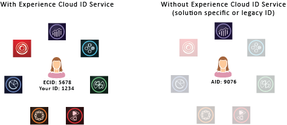

# About the ID Service{#aboutidservice}

The role of the Experience Cloud Identity Service in the Adobe Experience Cloud.

<!--
mcvid-functionality.xml
-->

## The Experience Cloud Identity Service: A Foundational Element of Core Services {#section-2de0eb1d65664e92a4d8bbb167b84bde}

The Experience Cloud Identity Service enables the common identification framework for the Experience Cloud Core Services, solutions, and customer attributes and audiences. It works by assigning a unique, persistent ID to a site visitor. When your organization implements the ID service, this ID lets you identify the same site visitor and their data in different Experience Cloud solutions.

Also, the ID service can replace the different solution-specific IDs (e.g., Analytics AID). And, through the [Customer IDs and Authentication States](../reference/authenticated-state.md) functionality, the ID service lets you pass in your own customer IDs to the [!DNL Experience Cloud]. Keep in mind, however, that the ID service only works with the solutions you're already subscribed to. It won't provide access to other products if you're not signed up for them.

Going forward, the ID service is an integral component of many current and future [!DNL Experience Cloud] features, enhancements, and services. Currently, the ID service supports [Analytics](http://www.adobe.com/marketing-cloud/web-analytics.html), [Audience Manager](http://www.adobe.com/marketing-cloud/data-management-platform.html), and [Target](http://www.adobe.com/marketing-cloud/testing-targeting.html). And, it is required if you want to participate in the [!DNL Adobe Experience Cloud] Device Co-op. If you have not implemented the ID service, now is the time to start considering a migration strategy. For more information about the importance and role of the ID service, see [Why the Experience Cloud Identity Service Should be on Your Radar](http://blogs.adobe.com/digitalmarketing/analytics/why-new-adobe-marketing-cloud-id-service-should-be-on-your-radar/).

## Feature Summary {#section-96555473455c4bf8924c2d56ff4f3255}

To sum up, the ID service:

* Creates a common key or ID which can be used to link profiles and identities. 
* Uniquely identifies a device across multiple solutions. 
* Sets a first-party cookie in customer’s domain to ensure tracking on same domain. See [Experience Cloud](../introduction/cookies.md). 
* Receives aliases and ID mappings from [!DNL Experience Cloud] customers and partners. 
* Manages ID synchronization within the [!DNL Experience Cloud]. 
* Supports ID synchronization with different third-parties across the ad tech ecosystem.
