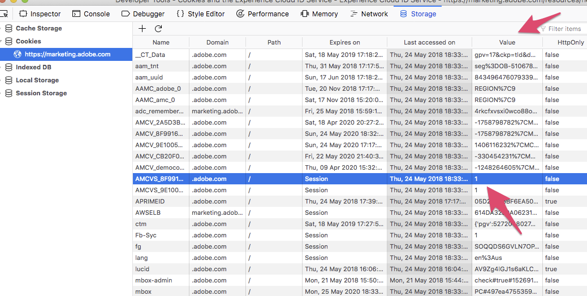

# Cookies and the Experience Cloud Identity Service{#cookies-and-the-experience-cloud-id-service}

The ID service uses your organization ID, the Experience Cloud AMCV cookie, and a demdex cookie to create and store unique, persistent identifiers for your site visitors. These cookies let the ID service track visitors across your different domains and enable data sharing among different Experience Cloud solutions.

## Understanding ID Service cookies {#section-f438168beaec409ab8b2cc58bd021e26}

The ID service relies on the AMCV, AMCVS, and demdex cookies to function properly. These cookies are just files that store data used by the ID service. These ID service cookies are not dangerous, malicious, or different from other first- or third-party cookies stored by a website or service in a browser, following the same rules that govern other first- and third-party cookies. Refer to the following sections below for more information about cookies used by the ID service.

### What the ID Service cookies can do

* Set and store a unique ID for your site visitors (the MID). 
* Persist this unique ID so the ID service can collect and share data with other Experience Cloud solutions. 
* Track users across your domains. However, this requires that you own those other domains and have ID service code deployed on them.

### What the ID Service ookies cannot do

* Store, transmit, or execute computer viruses. 
* Access or store personally identifiable information (PII) like your email address. 
* Control computer hardware or software. 
* Make computers unstable or cause performance problems. 
* Track users on sites that do not use the ID service.

## AMCV cookie {#section-c55af54828dc4cce89f6118655d694c8}

The following attributes of the cookie set by the ID service.

**Name**

The AMCV cookie name follows the syntax `AMCV_<variable name>@AdobeOrg`. In the name, the `<variable name>` elements are placeholders for part of your Experience Cloud organization ID. This ID is passed in to the DCS by the `Visitor.getInstance` function in the ID service code.

A fully formed cookie name would look similar to this:

```
AMCV_1FD6776A524453CC0A490D44%40AdobeOrg
```

**Contents**

The AMCV cookie contains the Experience Cloud visitor ID or MID. The MID is stored in a key-value pair that follows this syntax, `mid|<Experience Cloud ID>`.

A fully formed key-value pair would look similar to this:

```
mid|20265673158980419722735089753036633573
```

This persistent identifier enables cross-solution data sharing.

**Domain**

The AMCV cookie is set in the first-party domain of a browser. This means it is set in the domain of the site currently visited by a user. As such, ID service code and other Experience Cloud code libraries can read the MID stored in the AMCV cookie.

However, because the AMCV cookie is set in the first-party domain, it cannot be used to track and identify users across different domains. Instead, the ID service relies on the organization ID and the demdex ID to return the correct MID when a site visitor navigates to a different domain.

## AMCVS cookie {#section-92a9454f1ac645948f9059b9fad928bf}

**Name**

The AMCVS cookie name follows the syntax `AMCVS_####@AdobeOrg`. In the name, the #### elements are placeholders for part of your Experience Cloud organization ID. This ID is passed in to the DCS by `theVisitor.getInstance` function in the ID service code.

A fully formed cookie name would look similar to this:

```
AMCVS_1FD6776A524453CC0A490D44%40AdobeOrg
```

**Contents**

The AMCVS cookie serves as a flag indicating that the session has been initialized. Its value is always `1` and discontinues when the session has ended.

**Domain**

The AMCVS cookie is set in the first-party domain of a browser. This means it is set in the domain of the site currently visited by a user.



## Demdex cookie {#section-7ff7d96d6e4141b08a84a75a63d7814c}

The following table lists and defines some important attributes of the demdex cookie.

<table id="table_18E3CAF3550E4BB6A199736AACE39202"> 
 <thead> 
  <tr> 
   <th colname="col1" class="entry"> Attribute </th> 
   <th colname="col2" class="entry"> Description </th> 
  </tr> 
 </thead>
 <tbody> 
  <tr> 
   <td colname="col1"> <p> <b>Name</b> </p> </td> 
   <td colname="col2"> <p>The cookie name is "demdex." </p> </td> 
  </tr> 
  <tr> 
   <td colname="col1"> <p> <b>Contents</b> </p> </td> 
   <td colname="col2"> <p>The demdex cookie contains the demdex ID, which is generated by the DCS. </p> </td> 
  </tr> 
  <tr> 
   <td colname="col1"> <p> <b>Domain</b> </p> </td> 
   <td colname="col2"> <p>The demdex cookie is set in the third-party, demdex.net domain in the browser. This domain is separate from the site currently visited by a user. </p> <p>Unlike the first-party, AMCV cookie, the demdex cookie and ID persists across different domains. The demdex ID and your organization ID are the common values that allows the ID service to return and identify a site visitor with the right visitor ID. </p> </td> 
  </tr> 
 </tbody> 
</table>

For related information, see [Understanding Calls to the Demdex Domain](https://marketing.adobe.com/resources/help/en_US/aam/demdex-calls.html).

## Generating the Experience Cloud ID {#section-15f69c0bac394b4b9966a23fbc586d17}

The Experience Cloud ID (MID) is derived mathematically from your organization ID and the demdex ID. As long as these IDs remain constant, generating the right MID for a specific user is simply a math problem. With the same organization ID and demdex ID you get the same MID value every time. This allows the ID service to track visitors across domains that you control and have configured with ID service code.

The ID service starts to create a MID as your page loads. During this process, code provided by the `visitorAPI.js` code library sends your organization ID in an event call to the ID service. The ID service creates and returns the MID and a demdex ID in the AMCV and demdex cookies respectively.

## Cookies flags

The following table describes flags for Experience Cloud Cookies:

| Cookie (set by) | httpOnly | Secure | SameSite |
|--- |--- |--- |--- |
| demdex (http response) | No | Yes | "None"|
| AMCV (Javascript) | No | Configurable | Unset (defaults to Lax) |
| AMCVS (Javascript) | No | Configurable | Unset (defaults to Lax) |

*Note: For information on configuring the AMCV and AMCVS cookie with secure attributes, see the topic for [secureCookie](https://docs.adobe.com/content/help/en/id-service/using/id-service-api/configurations/securecookie.html).*

## Next steps {#section-8db1727a63bc4ff68b495f270315d453}

See [How the Experience Cloud Identity Service Requests and Sets IDs...](../introduction/id-request.md#concept-2caacebb1d244402816760e9b8bcef6a). 
