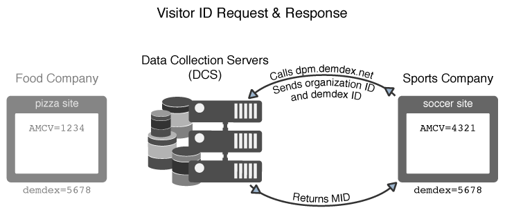

# How the Experience Cloud ID Service requests and sets IDs{#how-the-experience-cloud-id-service-requests-and-sets-ids}

An overview of the ID request and response process. These examples cover ID assignment on individual sites, across different sites, and for sites managed by different Experience Cloud customers with their own organization IDs.

>[!NOTE]
>
>If you're not familiar with how the Experience Cloud ID Service creates the visitor ID, take a moment to review [Experience Cloud](../introduction/cookies.md).

**Tip:** See also our [ID service video on cross-domain tracking](https://helpx.adobe.com/marketing-cloud-core/kb/MCID/CrossDomain.html).

## Requesting a Experience Cloud ID {#section-0b5e261fbd0547d9b9a1680e5ce536cc}

The following examples demonstrate how the ID service requests and receives the Experience Cloud visitor ID. These examples use two fictitious companies, the Food Company and the Sports Company, to demonstrate data flows for ID requests and responses. Each company has a unique Experience Cloud organization ID and has implemented the ID service code on all of their sites. These use cases represent data flows for a generic ID service implementation without Analytics, legacy IDs, or browsers that block third-party cookies.

**First request**

In this example, a new visitor comes to the pizza site managed by the Food Company. The Food Company has ID service code on the pizza website. When the pizza site loads, the ID service code checks for the AMCV cookie in the pizza domain.

* If the AMCV cookie is set, the site visitor has a Experience Cloud ID. In this case, the cookie tracks the visitor and shares data with other Experience Cloud solutions. 
* If the AMCV cookie is not set, the ID service code calls a regional [data collection server](https://marketing.adobe.com/resources/help/en_US/aam/?f=c_compcollect.html) (DCS) at `dpm.demdex.net/id` (see also, [Understanding Calls to the Demdex Domain](https://marketing.adobe.com/resources/help/en_US/aam/demdex-calls.html)). The call includes the organization ID for the Food Company. The organization ID is set in the `Visitor.getInstance` function of the ID service code.

**First response**

In the response, the DCS returns the [!DNL Experience Cloud] ID (MID) and the demdex cookie. The ID service code writes the MID value to the AMCV cookie. For example, say the DCS returns a MID value of 1234. It would be stored the AMCV cookie as `mid|1234` and set in the first-party, pizza domain. The demdex cookie also contains a unique ID (let's call it 5678). This cookie is set in the third-party, demdex.net domain, which is separate from the pizza domain.

As you'll see in the next example, the demdex ID and organization ID allows the ID service to create and return the correct MID when our visitor moves to another site belonging to the Food Company.

## Cross-site request and response {#section-15ea880453af467abd2874b8b4ed6ee9}

In this example, our Food Company visitor navigates to the tacos site from the pizza site. The Food Company has ID service code on the tacos website. The visitor has never been to the tacos website.

Given these conditions, there is no AMCV cookie on the tacos site. And, the ID service can't use the AMCV cookie set on the pizza site because that it is specific to the pizza domain. As a result, the ID service must call the DCS to check for and request a visitor ID. In this case, the DCS call includes the Food Company's organization ID *and* the demdex ID. And remember, the demdex ID is picked up from the pizza site and stored as a third-party cookie under the demdex.net domain.

After the DCS receives the organization ID and the demdex ID, it creates and returns the correct MID for our site visitor. Because the MID is derived mathematically from the organization ID and the demdex ID, the AMCV cookie contains the MID value, `mid = 1234`.

## ID requests from other sites {#section-ba9a929e50d64b0aba080630fd83b6f1}

In this example, our visitor leaves the Food Company sites and navigates to the soccer site owned by the Sports Company. When the visitor comes to the soccer site, the ID checking and request process works the same way as described in the previous examples. However, because the Sports Company has its own organization ID, the ID service returns a different MID. The new MID is unique to the domains controlled by the Sports Company and lets that enterprise track and share visitor data across solutions in the [!DNL Experience Cloud]. The demdex ID remains the same for this visitor because it's contained in a third-party cookie and persists across different domains.

