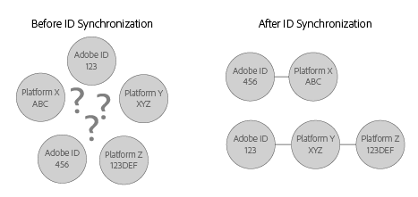

# Understanding ID synchronization and match rates{#understanding-id-synchronization-and-match-rates}

An overview of ID synchronization processes and match rates in the Experience Cloud Identity Service, including Adobe Media Optimizer and the ID service.

## ID synchronization and match rates {#section-f652aae7234945e89d26dd833c5215fb}

ID synchronization matches IDs assigned by the ID service to IDs assigned to site visitors by our customers. For example, say the ID service has assigned a visitor ID 1234. Another platform knows this visitor by ID 4321. The ID service maps these IDs together during the synchronization process. The results add new data points to what our customers know about their site visitors. And, if the ID service can't match an ID, it creates a new one and uses that ID for future synchronization.

Match rates measure and validate the effectiveness of the ID synchronization process. High match rates suggest that a particular service will be more effective and provide access to a larger online audience than a service with low match rates. Comparing match rates is a quantifiable way to evaluate different integrated ad tech platforms.

**Ensuring high match rates**

To generate high match rates, it is important to set up the ID service properly (see the [standard implementation guide](../implementation-guides/standard.md#concept-89cd0199a9634fc48644f2d61e3d2445)). A proper implementation helps ensure high match rates because lets the ID service set the cookies it requires to function and synchronize IDs with enabled data partners. However, factors such as slow Internet connections, data collection from mobile devices or wireless networks can affect how well the ID service collects, synchronizes, and matches IDs. These client-side variables are beyond the control of the ID service or [!DNL Adobe].

## ID synchronization process described {#section-a541a85cbbc74f5682824b1a2ee2a657}

The ID service synchronizes IDs in real-time. This process works in the browser instead of through a server-to-server data transfer. The following table describes the steps in the ID synchronization process.

**Step 1: Load page**

When a visitor comes to your site and loads a page, the `Visitor.getInstance` function makes a [CORS](../reference/cors.md#concept-6c280446990d46d88ba9da15d2dcc758) or JSON-P call to the ID service. The ID service responds with a cookie that includes the visitor's [!DNL Experience Cloud] ID (MID). The MID is a unique ID assigned to each site visitor. See also, [Cookies and the Experience Cloud Identity Service](../introduction/cookies.md).

**Step 2: Load iFrame**

While the page body is loading, the ID service loads an iFrame called the *`Destination Publishing iFrame`*. The [!UICONTROL Destination Publishing iFrame] loads in a domain separate from the parent page. This design helps ensure page performance and improves security because the iFrame:

* Loads asynchronously in relation to parent page. This means the parent page can load independently from the [!UICONTROL Destination Publishing iFrame]. Loading the iFrame and loading ID sync pixels from within the iFrame won't affect the parent page or the user experience. 
* Loads as fast as possible. If this is too fast, you can load the iFrame after the window load event (not recommended). See [idSyncAttachIframeOnWindowLoad](../library/function-vars/idsyncattachiframeonwindowload.md#reference-b86b7112e0814a4c82c4e24c158508f4) for details. 
* Prevents code in the iFrame from gaining access to or affecting the parent page.

See also, [How the Experience Cloud Identity Service Requests and Sets IDs...](../introduction/id-request.md#concept-2caacebb1d244402816760e9b8bcef6a).

**Step 3: Fire ID syncs**

The ID sync is a URL that is fired in the Destination Publishing iFrame. As shown in this generic example, an ID sync URL contains a partner's ID synchronization endpoint and a redirect URL, which is a redirect back to [!DNL Adobe] that includes their ID.

`http://abc.com?partner_id=abc&sync_id=123&redir=http://dpm.demdex.net/ibs:dpid=<ADOBE_PARTNER_ID>&dpuuid=<PARTNER_UUID>`

See also, [ID Synchronization for Inbound Data Transfers](https://marketing.adobe.com/resources/help/en_US/aam/c_id_sync_in.html).

**Step 4: Store IDs**

Synchronized IDs are stored on the [edge and core data servers](https://marketing.adobe.com/resources/help/en_US/aam/c_compedge.html).

## Sync services manages ID synchronization {#section-cd5784d7ad404a24aa28ad4816a0119a}

The term *`Sync Services`* refers to internal [!DNL Experience Cloud] technologies responsible for ID synchronization. This service is enabled by default. To disable it, add an [optional variable](../library/function-vars/disableidsync.md#reference-589d6b489ac64eddb5a7ff758945e414) to the ID service `Visitor.getInstance` function. Sync Services matches different [!DNL Experience Cloud] IDs such as:

* Third-party [!DNL Experience Cloud] cookie IDs to first-party [!DNL Experience Cloud] IDs. 

* First-party [!DNL Experience Cloud] cookie IDs to [!DNL Adobe Media Optimizer] (AMO) IDs. 

* Third-party [!DNL Experience Cloud] cookie IDs to third-party data provider and targeting platform IDs. This includes services and platforms such as data providers, demand and/or supply-side platforms, ad networks, exchanges, etc. 
* First-party [!DNL Experience Cloud] cookie IDs to cross-device partner IDs.

## ID synchronization with Adobe Media Optimizer {#section-642c885ea65d45ffb761f78838735016}

[!DNL Adobe Media Optimizer] is an exception to the iFrame-based ID synchronization process. Because [!DNL Media Optimizer] is a trusted domain, ID syncs take place from the parent page rather than in the [!UICONTROL Destination Publishing iFrame]. During synchronization, the ID service calls [!DNL Media Optimizer] at `cm.eversttech.net`, which is a legacy domain name used by [!DNL Media Optimizer] prior to its acquisition by Adobe. Sending data to [!DNL Media Optimizer] helps improve match rates and is automatic for ID service customers using version 2.0 (or higher). See also, [Media Optimizer Cookies](https://marketing.adobe.com/resources/help/en_US/whitepapers/cookies/cookies_media_optimizer.html). 

>[!MORELIKETHIS]
>
>* [Understanding Calls to the Demdex Domain](https://marketing.adobe.com/resources/help/en_US/aam/demdex-calls.html)
