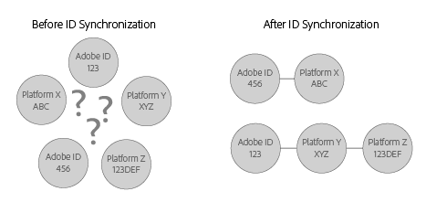

# Understanding ID synchronization and match rates{#understanding-id-synchronization-and-match-rates}

An overview of ID synchronization processes and match rates in the Visitor ID Service, including Adobe Media Optimizer and the Visitor ID Service.

## ID synchronization and match rates {#section-f652aae7234945e89d26dd833c5215fb}

ID synchronization matches IDs assigned by the Visitor ID Service to IDs assigned to site visitors by our customers. For example, say the Visitor ID Service has assigned a visitor ID 1234. Another platform knows this visitor by ID 4321. The Visitor ID Service maps these IDs together during the synchronization process. The results add new data points to what our customers know about their site visitors. And, if the Visitor ID Service can't match an ID, it creates a new one and uses that ID for future synchronization.

Match rates measure and validate the effectiveness of the ID synchronization process. High match rates suggest that a particular service will be more effective and provide access to a larger online audience than a service with low match rates. Comparing match rates is a quantifiable way to evaluate different integrated ad tech platforms.

**Ensuring high match rates**

A proper implementation helps ensure high match rates because lets the Visitor ID Service set the cookies it requires to function and synchronize IDs with enabled data partners. However, factors such as slow Internet connections, data collection from mobile devices or wireless networks can affect how well the Visitor ID Service collects, synchronizes, and matches IDs. These client-side variables are beyond the control of the Visitor ID Service or Adobe.

## ID synchronization process described {#section-a541a85cbbc74f5682824b1a2ee2a657}

The Visitor ID Service synchronizes IDs in real-time. This process works in the browser instead of through a server-to-server data transfer. The following table describes the steps in the ID synchronization process.

**Step 1: Load page**

When a visitor comes to your site and loads a page, the `Visitor.getInstance` function makes a [CORS](../reference/cors.md#concept-6c280446990d46d88ba9da15d2dcc758) or JSON-P call to the Visitor ID Service. The Visitor ID Service responds with a cookie that includes the visitor's ECID. The MID is a unique ID assigned to each site visitor. See also, [Cookies and the Visitor ID Service](../introduction/cookies.md).

**Step 2: Load iFrame**

While the page body is loading, the Visitor ID Service loads an iFrame called the *`Destination Publishing iFrame`*. The [!UICONTROL Destination Publishing iFrame] loads in a domain separate from the parent page. This design helps ensure page performance and improves security because the iFrame:

* Loads asynchronously in relation to parent page. This means the parent page can load independently from the [!UICONTROL Destination Publishing iFrame]. Loading the iFrame and loading ID sync pixels from within the iFrame won't affect the parent page or the user experience. 
* Loads as fast as possible. If this is too fast, you can load the iFrame after the window load event (not recommended). See [idSyncAttachIframeOnWindowLoad](../library/function-vars/idsyncattachiframeonwindowload.md#reference-b86b7112e0814a4c82c4e24c158508f4) for details. 
* Prevents code in the iFrame from gaining access to or affecting the parent page.

See also, [How the Visitor ID Service Requests and Sets IDs...](../introduction/id-request.md#concept-2caacebb1d244402816760e9b8bcef6a).

**Step 3: Fire ID syncs**

The ID sync is a URL that is fired in the Destination Publishing iFrame. As shown in this generic example, an ID sync URL contains a partner's ID synchronization endpoint and a redirect URL, which is a redirect back to Adobe that includes their ID.

`http://abc.com?partner_id=abc&sync_id=123&redir=http://dpm.demdex.net/ibs:dpid=<ADOBE_PARTNER_ID>&dpuuid=<PARTNER_UUID>`

See also, [ID Synchronization for Inbound Data Transfers](https://experienceleague.adobe.com/docs/audience-manager/user-guide/implementation-integration-guides/sending-audience-data/batch-data-transfer-process/id-sync-http.html?lang=en).

**Step 4: Store IDs**

Synchronized IDs are stored on the [edge and core data servers](https://experienceleague.adobe.com/docs/audience-manager/user-guide/reference/system-components/components-edge.html?lang=en).

## Sync services manages ID synchronization {#section-cd5784d7ad404a24aa28ad4816a0119a}

The term *`Sync Services`* refers to internal CX Enterprise technologies responsible for ID synchronization. This service is enabled by default. To disable it, add an [optional variable](../library/function-vars/disableidsync.md#reference-589d6b489ac64eddb5a7ff758945e414) to the Visitor ID Service `Visitor.getInstance` function. Sync Services matches different ECIDs such as:

* Third-party CX Enterprise cookie IDs to first-party ECIDs. 

* First-party CX Enterprise cookie IDs to Adobe Media Optimizer (AMO) IDs. 

* Third-party CX Enterprise cookie IDs to third-party data provider and targeting platform IDs. This includes services and platforms such as data providers, demand and/or supply-side platforms, ad networks, exchanges, etc. 
* First-party CX Enterprise cookie IDs to cross-device partner IDs.

## ID synchronization with Adobe Advertising Cloud {#section-642c885ea65d45ffb761f78838735016}

Adobe Advertising Cloud (previously called Adobe Media Optimizer)is an exception to the iFrame-based ID synchronization process. Because Advertising Cloud is a trusted domain, ID syncs take place from the parent page rather than in the [!UICONTROL Destination Publishing iFrame]. During synchronization, the Visitor ID Service calls Advertising Cloud at `cm.eversttech.net`, which is a legacy domain name used by Advertising Cloud prior to its acquisition by Adobe. Sending data to Advertising Cloud helps improve match rates and is automatic for Visitor ID Service customers using version 2.0 (or higher). See also, [Advertising Cloud Cookies](https://experienceleague.adobe.com/docs/core-services/interface/administration/ec-cookies/cookies-advertising-cloud.html?lang=en). 

>[!MORELIKETHIS]
>
>* [Understanding Calls to the Demdex Domain](https://experienceleague.adobe.com/docs/audience-manager/user-guide/reference/demdex-calls.html?lang=en)

