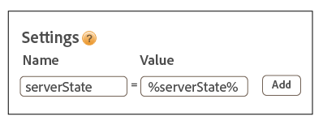

# Using the ID Service with A4T and a server-side implementation of Target {#using-the-id-service-with-a-t-and-a-server-side-implementation-of-target}

These instructions are for A4T customers with mixed server- and client-side implementations of Target, Analytics, and the ID service. Customers who need to run the ID service in a NodeJS or Rhino environment should also review this information. This instance of the ID service uses a shortened version the VisitorAPI.js code library, which you download and install from Node Package Manager (NPM). Review this section for installation instructions and other configuration requirements.

## Introduction {#section-ab0521ff5bbd44c592c3eaab31c1de8b}

A4T (and other customers) can use this version of the ID service when they need to:

* Render web page content on their servers and pass it to a browser for final display. 
* Make server-side [!DNL Target] calls. 
* Make client-side (in-browser) calls to [!DNL Analytics]. 
* Synchronize separate [!DNL Target] and [!DNL Analytics] IDs to determine if a visitor seen by one solution is the same person as seen by the other solution.

## Code download and provided interfaces {#section-32d75561438b4c3dba8861be6557be8a}

See the [ID service NPM repository](https://www.npmjs.com/package/@adobe-mcid/visitor-js-server) to download the server-side code package and review the interfaces included in the current build.

## Workflow {#section-56b01017922046ed96536404239a272b}

The diagram and sections below describe what happens, and what you need to configure, in each step of the server-side implementation process.


## Step 1: Request page {#section-c12e82633bc94e8b8a65747115d0dda8}

Server-side activity begins when a visitor makes an HTTP request to load a web page. During this step, your server receives this request and checks for the [AMCV cookie](../mcvid-overview/mcvid-cookies.md#concept-37156268512445f287cd4bbb2839ffaa). The AMCV cookie contains the visitor's [!DNL Experience Cloud] ID (MID).

## Step 2: Generate ID Service payload {#section-c86531863db24bd9a5b761c1a2e0d964}

Next, you need make a server-side *`payload request`* to the ID service. A payload request:

* Passes the AMCV cookie to the ID service. 
* Requests data that is required by Target and Analytics in subsequent steps described below.

>[!NOTE]
>
>This method requests a single mbox from [!DNL Target]. If you need to request multiple mboxes in a single call, see [generateBatchPayload](https://www.npmjs.com/package/@adobe-mcid/visitor-js-server#generatebatchpayload).

Your payload request should look like following code sample. In the code sample, the `visitor.setCustomerIDs` function is optional. See [Customer IDs and Authentication States](../mcvid-reference/mcvid-authenticated-state.md#concept-3402b7704d534321b7560592098b46fd) for more information.

```js
//Import the ID service server package 
var Visitor = require("@adobe-mcid/visitor-js-server"); 
 
//Pass in your Organization ID to instantiate Visitor 
var visitor = new Visitor("Insert Experience Cloud ID here"); 
 
// 
<i>(Optional)</i> Set a custom customer ID 
visitor.setCustomerIDs({ 
     userid:{ 
          id:"1234", 
          authState: Visitor.AuthState.UNKNOWN //AuthState is a static property of the Visitor class 
     } 
}); 
 
//Parse the visitor's HTTP request for the AMCV cookie 
var cookies = cookie.parse(req.headers.cookie || ""); 
var cookieName = visitor.getCookieName(); // Visitor API that returns the cookie name. 
var amcvCookie = cookies[cookieName]; 
 
//Generate the payload request pass your mbox name and the AMCV cookie if present 
var visitorPayload = visitor.generatePayload({ 
     mboxName: "bottom-banner-mbox", 
     amcvCookie: amcvCookie 
});
```

The ID service returns the payload in a JSON object similar to the following example. Payload data is required by [!DNL Target].

```js
{ 
    "marketingCloudVisitorId": "02111696918527575543455026275721941645", 
    "mboxParameters": { 
        "mboxAAMB": "abcd1234", 
        "mboxMCGLH": "9", 
        "mboxMCSDID": "56BE026543F7E211-1CC51BCAAE88F0D2", 
        "vst.userid.id": "1234567890", 
        "vst.userid.authState": 0 
    } 
}
```

If your visitor doesn't have an AMCV cookie, the payload omits these key-value pairs:

* `marketingCloudvisitorId` 
* `mboxAAMB` 
* `mboxMCGLH`

## Step 3: Add payload to the Target call {#section-62451aa70d2f44ceb9fd0dc2d4f780f7}

After your server receives payload data from the ID service, you need to instantiate additional code to merge it with data passed in to [!DNL Target]. The final JSON object passed to [!DNL Target] would look similar to this:

```js
{ 
"mbox" : "target-global-mbox", 
"marketingCloudVisitorId":"02111696918527575543455026275721941645", 
"requestLocation" : { 
     "pageURL" : "http://www.domain.com/test/demo.html", 
     "host" : "localhost:3000" 
     }, 
"mboxParameters" : { 
     "mboxAAMB" : "abcd1234", 
     "mboxMCGLH" : "9", 
     "mboxMCSDID": "56BE026543F7E211-1CC51BCAAE88F0D2", 
     "vst.userid.id": "1234567890", 
     "vst.userid.authState": 0, 
     } 
} 

```

## Step 4: Get server state for the ID Service {#section-8ebfd177d42941c1893bfdde6e514280}

Server state data contains information about work that's been done on the server. The client-side ID service code requires this information. Customers who have implemented the ID service through [!DNL Dynamic Tag Manager] (DTM) can configure DTM to pass server state data through that tool. If you've set up the ID service through a non-standard process, you will need to return server state with your own code. The client-side ID service and [!DNL Analytics] code passes state data to Adobe when the page loads.

**Get server state via DTM**

If you have implemented the ID service with DTM, you need to add code to your page and specify a name-value pair in the DTM settings.

**Page Code**

Add this code to the `<head>` tag of your HTML page:

```js
//Get server state 
var serverState = visitor.getState(); 
 
Response.send(" 
... 
<head> 
     <script> 
          //Add 'serverState' as a stringified JSON global variable. 
          "var serverState = "+ JSON.stringify(serverState) +";  
     </script> 
     <script src = "DTM script (satellite JS)"> 
     </script> 
</head> 
...
```

**DTM Settings**

Add these as name-value pairs to the **[!UICONTROL General > Settings]** section of your ID service instance:

* **[!UICONTROL Name:]** serverState 
* **[!UICONTROL Value:]** %serverState% 

  >[!IMPORTANT]
  >
  >The value name must match the variable name you set for `serverState` in your page code.

Your configured settings should look like this:



See also, [Experience Cloud ID Service Settings for DTM](../mcvid-implementation-guides/mcvid-standard.md#concept-fb6cb6a0e6cc4f10b92371f8671f6b59).

**Get server state without DTM**

If you have a non-standard implementation of the ID service, you must configure this code to run on your server while it assembles the requested page:

```js
//Get server state 
var serverState = visitor.getState(); 
 
Response.send(" 
... 
<head> 
     <script src="VisitorAPI.js"></script> 
     <script> 
          var visitor = Visitor.getInstance(orgID, { 
          serverState: serverState  
          ... 
     </script> 
</head> 
...
```

## Step 5: Serve a page and return Experience Cloud data {#section-4b5631a0d75a41febd6f43f8c214c263}

At this point, the web server sends page content to the visitor's browser. From this point on, the browser (not the server) makes all the remaining ID service and [!DNL Analytics] calls. For example, in the browser:

* The ID service receives state data from the server and passes the SDID to AppMeasurement. 
* AppMeasurement sends data about the page hit to [!DNL Analytics], including the SDID. 
* [!DNL Analytics] and [!DNL Target] compare SDIDs for this visitor. With an identical SDID, [!DNL Target] and [!DNL Analytics] stitch the server-side call and the client-side call together. At this point, both solutions now recognize this visitor as the same person.

>[!MORE_LIKE_THIS]
>
>* [Server-Side ID Service Package from Node Package Manager](https://www.npmjs.com/package/@adobe-mcid/visitor-js-server)
