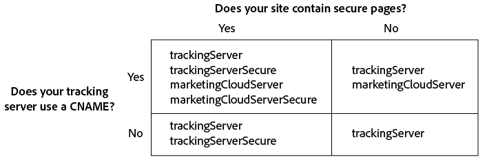

# Implement the Experience Cloud ID Service for Analytics and Audience Manager{#implement-the-experience-cloud-id-service-for-analytics-and-audience-manager}

These instructions are for Analytics and Audience Manager customers who want to use the Experience Cloud ID service and do not use Dynamic Tag Management (DTM). However, we strongly recommend that you use DTM to implement the ID service. DTM streamlines the implementation workflow and automatically ensures the correct code placement and sequencing.

>[!IMPORTANT]
>
>* [Read the requirements](../mcvid-reference/mcvid-requirements.md) before you begin. 
>* This procedure requires AppMeasurement. Customers using s_code cannot complete this procedure. 
>* Configure and test this code in a development environment before implementing it in production. 
>

## Step 1: Plan for server-side forwarding {#section-880797cc992d4755b29cada7b831f1fc}

In addition to the steps described here, customers who use [!DNL Analytics] and [!DNL Audience Manager] should migrate to server-side forwarding. Server-side forwarding lets you remove DIL (Audience Manager's data collection code) and replace it with the [Audience Management Module](https://marketing.adobe.com/resources/help/en_US/aam/c_profiles_audiences.html). See the [server-side forwarding documentation](https://marketing.adobe.com/resources/help/en_US/analytics/audiences/ssf.html) for more information.

Migrating to server-side forwarding requires planning and coordination. This process involves external changes to your site code and internal steps that Adobe must take to provision your account. In fact, many of these migration procedures need to happen in parallel and get released together. Your implementation path should follow this sequence of events:

1. Work with your [!DNL Analytics] and [!DNL Audience Manager] contacts to plan your ID service and server-side forwarding migration. Make selecting a tracking server an important part of this plan. 

1. Get provisioned for [!DNL Profiles & Audiences]. Complete the form on the [integrations and provisioning site](https://adobe.allegiancetech.com/cgi-bin/qwebcorporate.dll?idx=X8SVES) to get started. 

1. Implement the ID service and the [!DNL Audience Management Module] simultaneously. To work properly, the [!DNL Audience Management Module] (server-side forwarding) and the ID service must be released for the same set of pages and at the same time.

## Step 2: Download the ID Service code {#section-0780126cf43e4ad9b6fc5fe17bb3ef86}

The ID Service requires the `VisitorAPI.js` code library. To download this code library:

1. Go to **[!UICONTROL Admin]** > **[!UICONTROL Code Manager]**. 

1. In Code Manager, click either **[!UICONTROL JavaScrpt (New)]** or **[!UICONTROL JavaScript (Legacy)]**. This downloads compressed code libraries. 

1. Decompress the code file and open the `VisitorAPI.js` file.

## Step 3: Add the Visitor.getInstance function to the ID Service code {#section-9e30838b4d0741658a7a492153c49f27}

>[!IMPORTANT]
>
>* Previous versions of the ID service API placed this function in a different location and required a different syntax. If you are migrating from a version prior to [version 1.4](../mcvid-release-notes/mcvid-notes-2015.md#section-f5c596f355b14da28f45c798df513572), note the new placement and syntax documented here. 
>* Code in ALL CAPS is a placeholder for actual values. Replace this text with your Organization ID, tracking server URL, or other named value. 
>

**Part 1: Copy the Visitor.getInstance function below**

```js
var visitor = Visitor.getInstance("INSERT-MARKETING-CLOUD-ORGANIZATION ID-HERE", { 
     trackingServer: "INSERT-TRACKING-SERVER-HERE", // same as s.trackingServer 
     trackingServerSecure: "INSERT-SECURE-TRACKING-SERVER-HERE", // same as s.trackingServerSecure 
 
     // To enable CNAME support, add the following configuration variables 
     // If you are not using CNAME, DO NOT include these variables 
     marketingCloudServer: "INSERT-TRACKING-SERVER-HERE", 
     marketingCloudServerSecure: "INSERT-SECURE-TRACKING-SERVER-HERE" // same as s.trackingServerSecure 
}); 

```

**Part 2: Add function code to the Visitor API.js file**

Place the `Visitor.getInstance` function at the end of the file after the code block. Your edited file should look like this:

```js
/* 
========== DO NOT ALTER ANYTHING BELOW THIS LINE ========== 
Version and copyright section 
*/ 
 
// Visitor API code library section 
 
// Put Visitor.getInstance at the end of the file, after the code library 
 
var visitor = Visitor.getInstance("INSERT-MARKETING-CLOUD-ORGANIZATION ID-HERE", { 
     trackingServer: "INSERT-TRACKING-SERVER-HERE", // same as s.trackingServer 
     trackingServerSecure: "INSERT-SECURE-TRACKING-SERVER-HERE", // same as s.trackingServerSecure 
 
     // To enable CNAME support, add the following configuration variables 
     // If you are not using CNAME, DO NOT include these variables 
     marketingCloudServer: "INSERT-TRACKING-SERVER-HERE", 
     marketingCloudServerSecure: "INSERT-SECURE-TRACKING-SERVER-HERE" // same as s.trackingServerSecure 
}); 

```

## Step 4: Add your Experience Cloud Organization ID to Visitor.getInstance {#section-e2947313492546789b0c3b2fc3e897d8}

In the `Visitor.getInstance` function, replace `INSERT-MARKETING-CLOUD-ORGANIZATION ID-HERE` with your Experience Cloud organization ID. If you do not know your organization ID, you can find it on the Experience Cloud administration page. Your edited function could look similar to the example below.

`var visitor = Visitor.getInstance("1234567ABC@AdobeOrg", { ...`

>[!IMPORTANT]
>
>*Do not* change the case of the characters in your organization ID. The ID is case-sensitive and must be used exactly as provided.

## Step 5: Add your tracking servers to Visitor.getInstance {#section-0dfc52096ac2427f86045aab9a0e0dfc}

Analytics uses tracking servers for data collection.

**Part 1: Find your tracking server URLs**

Check your `s_code.js` or `AppMeasurement.js` files to find the tracking server URLs. You'll want the URLs specified by these variables:

* `s.trackingServer` 
* `s.trackingServerSecure`

**Part 2: Set tracking server variables**

To determine which tracking server variables to use:

1. Answer the questions in the decision matrix below. Use the variables that correspond to your answers. 
1. Replace the tracking server placeholders with your tracking server URLs. 
1. Remove unused tracking server and Experience Cloud server variables from the code.



>[!NOTE]
>
>When used, match the Experience Cloud server URLs to their corresponding tracking server URLs like this:

* Experience Cloud server URL = tracking server URL 
* Experience Cloud server secure URL = tracking server secure URL

If you're not sure how to find your tracking server see the [FAQ](../mcvid-faq-intro/mcvid-faq.md) and [Correctly Populate the trackingServer and trackingServerSecure variables](https://helpx.adobe.com/analytics/kb/determining-data-center.html#).

## Step 6: Update your AppMeasurement.js file {#section-5517e94a09bc44dfb492ebca14b43048}

This step requires [!DNL AppMeasurement]. You cannot continue if you're still using s_code.

Add the `Visitor.getInstance` function shown below to your `AppMeasurement.js` file. Place it in the section that contains configurations such as `linkInternalFilters`, `charSet`, `trackDownloads`, etc. :

`s.visitor = Visitor.getInstance("INSERT-MARKETING-CLOUD-ORGANIZATION ID-HERE");`

>[!IMPORTANT]
>
>At this point, you should remove the [!DNL Audience Manager] DIL code and replace it with the Audience Management Module. See [Implement Server-Side Forwarding](https://marketing.adobe.com/resources/help/en_US/reference/ssf.html) for instructions.

***(Optional, but recommended)* Create a custom prop**

Set a custom prop in `AppMeasurement.js` to measure coverage. Add this custom prop to the `doPlugins` function of your `AppMeasurement.js` file:

```js
// prop1 is used as an example only. Choose any available prop. 
s.prop1 = (typeof(Visitor) != "undefined" ? "VisitorAPI Present" : "VisitorAPI Missing");
```

## Step 7: Add visitor API code to the page {#section-c2bd096a3e484872a72967b6468d3673}

Place the ` [!DNL VisitorAPI.js]` file within the `<head>` tags on each page. When you the `VisitorAPI.js` file to your page:

* Put it at the beginning of the `<head>` section to it appears before other solution tags. 
* It must execute before AppMeasurement and the code for other [!DNL Experience Cloud] solutions.

## Step 8: (Optional) Configure a grace period {#section-aceacdb7d5794f25ac6ff46f82e148e1}

If any of these use cases apply to your situation, ask [Customer Care](https://helpx.adobe.com/marketing-cloud/contact-support.html) to set up a temporary [grace period](../mcvid-reference/mcvid-analytics-reference/mcvid-grace-period.md). Grace periods can run for up to 180-days. You can renew a grace period if required.

**Partial Implementation**

You need a grace period if you have some pages that use the ID service and some pages that do not, and they all report into the same Analytics report suite. This is common if you have a global report suite that reports across domains.

Discontinue the grace period after the ID service is deployed on all your web pages that report into the same report suite.

**s_vi Cookie Requirements**

You need a grace period if you require new visitors to have an s_vi cookie after migrating to the ID service. This is common if your implementation reads the s_vi cookie and stores it in a variable.

Discontinue the grace period after your implementation can capture the MID instead of reading the s_vi cookie.

See also, [Cookies and the Experience Cloud ID Service](../mcvid-introduction/mcvid-cookies.md).

**Clickstream Data Integration**

You need a grace period if you send data to an internal system from a Clickstream data feed and that processes uses the `visid_high` and `visid_low` columns.

Discontinue the grace period after your data ingestion process can use the `post_visid_high` and `post_visid_low` columns.

See also, [Clickstream Data Column Reference](https://marketing.adobe.com/resources/help/en_US/sc/clickstream/datafeeds_reference.html).

## Step 9: Test and deploy ID Service code {#section-f857542bfc70496dbb9f318d6b3ae110}

You can test and deploy as follows.

**Test and verify**

To test your ID service implementation, check for the:

* [AMCV cookie](../mcvid-introduction/mcvid-cookies.md) in the domain where you pages is hosted. 
* MID value in the Analytics image request with the [Adobe debugger](https://marketing.adobe.com/resources/help/en_US/sc/implement/debugger.html). 
* See also, [Test and Verify the Experience Cloud ID Service](../mcvid-implementation-guides/mcvid-test-verify.md).

To verify server-side forwarding, see [How to Verify your Server-Side Forwarding Implementation](https://marketing.adobe.com/resources/help/en_US/reference/ssf-verify.html).

**Deploy**

Deploy your code after it passes testing.

If you enabled a grace period:

* Ensure the Analytics ID (AID) and MID are in the image request. 
* Remember to disable the grace period once you meet the criteria for discontinuation.

