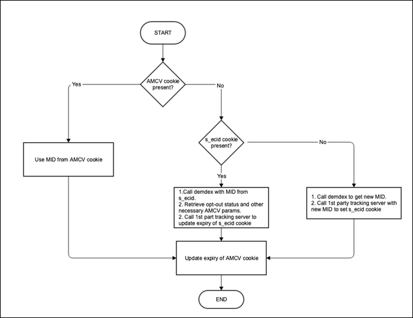

# ECID library methods in a Safari ITP world

>[!NOTE]
>
>Updates have been made to reflect the latest changes to ITP that were released on November 12, 2020 as part of the Big Sur OS release.

As Safari tightens up cross-domain tracking via ITP, Adobe must maintain best practices for libraries that support customers as well as consumer privacy and choice.

As of November 10, 2020, all first-party persistent cookies set through the document.cookie API, often known as “client-side” cookies, and cookies set through first-party CNAME implementations in Safari and mobile iOS browsers have their expiration capped at seven days. Third-party cookies will continue to be blocked, as stated in previous versions of ITP. For more details on ITP 2.1 and the impact of Adobe solutions, read [Safari ITP 2.1 Impact on Adobe Experience Cloud and Experience Platform Customers](https://medium.com/adobetech/safari-itp-2-1-impact-on-adobe-experience-cloud-customers-9439cecb55ac).

## ITP related changes, methods, and configurations

As additional methods are created for tracking within Safari, they will be added as reference to this page.

>[!NOTE]
>
>*ECID* = *MID* = *MCID* in all documentation below.

See below for efforts related to ITP and ECID library usage.

## Current ECID library behavior with ITP and Apple's WebKit

ITP 2.1 hampers the ability to write client-side cookies, which impairs the ability to provide accurate visitor tracking information to customers. As such, a change is being introduced in Adobe's CNAME tracking servers to store the visitor's Experience Cloud ID (ECID) in a first-party cookie.

This change is only helpful for ECID customers using an Analytics CNAME in first-party context. If you are an Analytics customer not currently using a CNAME, or even a non-Analytics customer, you are still eligible for a CNAME record. Contact Customer Care or your account representative to start the process of registering for a [CNAME](https://docs.adobe.com/content/help/en/core-services/interface/ec-cookies/cookies-first-party.html).

Upgrade to ECID library v. 4.3.0 + to take advantage of this change.

The following outlines how the ECID library behaves with ITP 2.1 and the latest changes made by Apple as part of the Big Sur release

**Design**

Once an ID request is made to demdex.net and an ECID is retrieved, if a tracking server is set in your ECID library, an ID request is made to the customer's domain. This endpoint reads the ecid param from the query string, and sets a new [cookie](/help/introduction/cookies.md) that comprises only the ECID and an expiration date two years in the future. Each time this endpoint is called in this manner, the `s_ecid` cookie is rewritten with an expiration date two years from the time of that call. ECID library needs to be updated to v 4.3.0 so that the value of this cookie can be retrieved.

>[!IMPORTANT]
>
>As part of the Big Sur updates, an `s_ecid` cookie set via CNAME is also held to a seven-day expiry.

This new `s_ecid` cookie follows the same opt-out status as the AMCV cookie. If the ecid is read from the `s_ecid` cookie, demdex is always immediately called to retrieve the latest opt-out status for that ID and stored in the AMCV cookie.

In addition, if your consumer has opted out of Analytics tracking via this [method](https://docs.adobe.com/content/help/en/analytics/implementation/js/opt-out.html), this `s_ecid` cookie will be deleted.

The tracking server name should be supplied to the VisitorJS library when initializing the library using `trackingServer` or `trackingServerSecure`. This should match the `trackingServer` config in the Analytics configs.

If you choose not to take advantage of this method, add the following config to your ECID library implementation: `discardtrackingServerECID`. When this config is set to true, Visitor library does not read the MID set by the first-party tracking server.

## Use appendVisitorIDsTo method for cross-domain tracking (within your own company's multiple domains)

This function lets you share a visitor's ECID across domains when browsers block third-party cookies. To use this function, you must have implemented the ID service and own the source and destination domains. Available in VisitorAPI.js version 1.7.0 or higher (but not in version 1.10.0).

**Design**

* As a visitor browses to your other domains, the Visitor.appendVisitorIDsTo(url) returns a URL with ECID appended as a query parameter.

    Use this URL to redirect from the original domain to the destination domain.

* The ID service code on the destination domain extracts the ECID from the URL instead of sending a request to Adobe for that visitor's ID.

    This request includes the third-party cookie ID, which is not available in this case.

* The ID service code on the destination page uses the passed-in ECID to track the visitor.

    >[!NOTE]
    >If the destination page already has a ECID from previous visits, then the decision to over-write the existing cookie is controlled by this config overwriteCrossDomainMCIDAndAID. For details about this config, see [overwriteCrossDomainMCIDAndAID](/help/library/function-vars/overwrite-visitor-id.md).
    >
    >For more details on this method, see the [appendVisitorIDsTo (Cross Domain Tracking)](/help/library/get-set/appendvisitorid.md) reference page.
