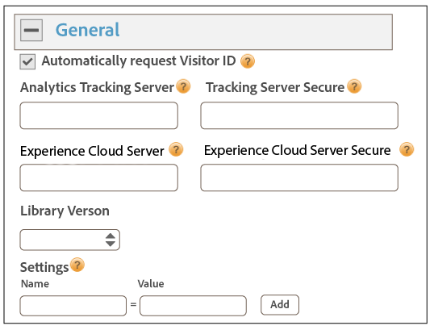

# Implementation with Dynamic Tag Management{#implementation-with-dynamic-tag-management}

Older implementations use Dynamic Tag Management (DTM) to set up, deploy, and integrate the Experience Cloud ID service with your other Experience Cloud solutions.

## Implementation with Dynamic Tag Management {#topic-6f4ed5d96977406ca991e50f3fbd5b01}

Older implementations use Dynamic Tag Management (DTM) to set up, deploy, and integrate the Experience Cloud ID service with your other Experience Cloud solutions.

>[!NOTE]
>
>Currently, [Launch, by Adobe](https://docs.adobelaunch.com/) is the preferred and recommended implementation tool because it helps simplify complex tag management tasks and automates code placement beyond the capabilities of DTM. See [Implement with Launch](../implementation-guides/ecid-implement-with-launch.md).

## Dynamic Tag Management and the ID Service {#section-4a4c4fac5d0a4cbbaff8e1833f73657c}

[Dynamic Tag Management](https://marketing.adobe.com/resources/help/en_US/dtm/) lets you configure, deploy, and manage your ID service instance and related [!DNL Experience Cloud] solution integrations. DTM helps simplify the implementation process because it is deeply integrated with the ID service and other Experience Cloud solutions. Simply add and configure the Experience Cloud ID tool and specify information, such as:

* Experience Cloud Organization ID (automatically populated if linked to the Experience Cloud) 
* Analytics tracking server (secure and non-secure) 
* Experience Cloud server (for first-party tracking servers)

DTM is available at no charge to any [!DNL Experience Cloud] customer.

**Getting started with DTM**

DTM is a simple yet powerful tool. If you're not already using it, we strongly encourage you to do so. See the DTM [documentation](https://marketing.adobe.com/resources/help/en_US/dtm/c_overview.html) and [DTM Jump Start videos](https://marketing.adobe.com/resources/help/en_US/dtm/jump-start-videos.html) to get started with this service. For instructions on how to set up the ID service with DTM, see the information and procedures in the sections below. 

## Deployment guidelines {#concept-54a2ec49af8f4bfca9207b1d404e8e1a}

Review this these requirements and procedures before you try to implement the Experience Cloud ID service with Dynamic Tag Management (DTM).

<!--
mcvid-dtm-deployment.xml
-->

**Provision your account**

Before you can get started, make sure your organization and solutions have been provisioned for the [!DNL Experience Cloud] and you're familiar with [!DNL Dyanamic Tag Management]. This documentation can help you get started:

* [Enable your solutions for core services](https://marketing.adobe.com/resources/help/en_US/mcloud/core_services.html): Implement the Experience Cloud and become an administrator. This process modernizes your solutions for core services like customer attributes and Experience Cloud audiences. 
* [Getting Started with Dynamic Tag Management](https://marketing.adobe.com/resources/help/en_US/dtm/get_started.html) 
* [Jump Start Videos](https://marketing.adobe.com/resources/help/en_US/dtm/jump-start-videos.html): A series of short videos that demonstrate how to perform basic DTM tasks.

**ID Service code placement and load order**

The ID service works by requesting and receiving a unique ID from the [!DNL Adobe] data collection servers. To work properly, your ID service code must be:

* The first block of [!DNL Adobe] code that executes on the page. 
* Placed as high on the page as possible, usually within the `<head>` code block.

As long as you maintain all of your [!DNL Adobe] solutions and code libraries in DTM, it will ensure that your ID service code is placed in the right location and fires at the right time.

**Validate regional data collection**

Customers must provide a CNAME or use [!DNL *.sc.omtrdc] for [regional data collection](https://marketing.adobe.com/resources/help/en_US/whitepapers/rdc/) (RDC). Obtain the specific, RDC settings from your [!DNL Adobe] consultant.

**Configure Analytics report suites**

New [!DNL Analytics] customers should [create a report suite](https://marketing.adobe.com/resources/help/en_US/reference/new_report_suite.html) for data collection. 

## Implement the Experience Cloud ID Service with DTM {#task-a659cf19dea84ad48edabe0b72ef9f5c}

Follow these steps to implement the ID service with Dynamic Tag Management (DTM). 

**Prerequisites**

* Enable your solutions for the [!DNL Experience Cloud] and verify that you have administrator permissions. See [Enable your solutions for core services](https://marketing.adobe.com/resources/help/en_US/mcloud/core_services.html). 

* Create a web property in DTM. See the DTM [Create a Web Property](https://marketing.adobe.com/resources/help/en_US/dtm/web_property.html) documentation or the [Admin Jump Start video](https://marketing.adobe.com/resources/help/en_US/dtm/admin-jump-start.html).

<!--
mcvid-dtm-implement.xml
-->

**Implementation steps** To implement the ID service with DTM: 

1. In the DTM [!DNL Dashboard], click the web property you want to work with.
1. In the **[!UICONTROL Overview]** tab of your selected web property, click **[!UICONTROL Add a Tool]**.
1. In the **[!UICONTROL Tool Type]** list, click **[!UICONTROL Experience Cloud ID Service]**.

   >[!NOTE]
   >
   >This action populates the **[!UICONTROL Experience Cloud Organization ID]** box with your Organization ID. If your DTM account is not linked to the [!DNL Experience Cloud], you will have to provide this ID. To link your account, see [Link Accounts in the Experience Cloud](https://marketing.adobe.com/resources/help/en_US/mcloud/organizations.html). See the [requirements](../reference/requirements.md#section-a02f537129a64ffbb690d5738d360c26) for information about how to find your Organization ID.

1. Type the name of your tracking server in the **[!UICONTROL Tracking Server]** box. If you're not sure how to find your tracking server see the [FAQ](../faq-intro/faq.md) and [Correctly Populate the trackingServer and trackingServerSecure variables](https://helpx.adobe.com/analytics/kb/determining-data-center.html#).
1. Click **[!UICONTROL Create Tool]** and **[!UICONTROL Save Changes]**.

   After saving, the ID service is set up as a tool in DTM. However, it is not ready to use yet. Your DTM tool still has to go through the DTM publishing/approval process and you may want to configure additional parameters. For information about the DTM approval process, see the [User Basics Jump Start](https://marketing.adobe.com/resources/help/en_US/dtm/user-basics-jump-start.html) video. For information about the additional parameters you can add to DTM, see [Experience Cloud ID Service Settings for DTM](../implementation-guides/standard.md#concept-fb6cb6a0e6cc4f10b92371f8671f6b59).

>[!MORE_LIKE_THIS]
>
>* [Web Properties](https://marketing.adobe.com/resources/help/en_US/dtm/web_property.html)

## Experience Cloud ID Service Settings for DTM {#concept-fb6cb6a0e6cc4f10b92371f8671f6b59}

Describes the [!DNL Organization ID], [!DNL General] and [!DNL Customer Settings] fields and how they're used by the [!DNL Experience Cloud] ID service.

<!--
mcvid-dtm-settings.xml
-->

## How do I find these settings? {#section-c5b2d1c928944ae2b8565c1b182fe575}

The settings are available after you add and save the ID service as a tool in Dynamic Tag Management (DTM). You can also access these settings by clicking the gear icon from the [!DNL Installed Tools] section of your DTM web property.


## Organization ID {#section-949b5a0d8af940558b04ff675cf53f77}

This is the ID required by and associated with your provisioned [!DNL Experience Cloud] company. An organization is the entity that enables an administrator to configure users, groups, and control single sign-on access in the [!DNL Experience Cloud]. The Organization ID is a 24-character alphanumeric string, followed by (and must include) @AdobeOrg. [!DNL Experience Cloud] administrators can find this ID in [Experience Cloud > Tools](https://marketing.adobe.com/resources/help/en_US/mcloud/admin_getting_started.html).


See also [Cookies and the Experience Cloud ID Service](../introduction/cookies.md).

## General settings {#section-071d358e40f84629a8901b893dd61392}

These settings let you specify tracking servers, code versions, and add other variables.



The following table lists and defines the [!DNL General] settings.

**Automatically request Visitor ID**

When checked, dynamic tag management to automatically calls the `getMarketingCloudVisitorID()` method before loading any of the Adobe solutions that use the Experience Cloud ID service.

See [getMarketingCloudVisitorID](../library/get-set/getmcvid.md).

**Analytics Tracking Server**

The name of the tracking server used for Analytics data collection. This is the domain at which the image request and cookie is written (e.g., [!DNL http://site.omtrdc.net]).

If you don't know your tracking server URLs, check your `s_code.js` or `AppMeasurement.js` files. You'll want the URL set by the `s.trackingServer` variable.

See [trackingServer](https://marketing.adobe.com/resources/help/en_US/sc/implement/trackingServer.html) and [Correctly Populate the trackingServer and trackingServerSecure variable](https://helpx.adobe.com/analytics/kb/determining-data-center.html#).

**Tracking Server Secure**

The name of the secure tracking server used for Analytics data collection. This is the domain at which the image request and cookie is written (e.g., [!DNL https://site.omtrdc.net]).

If you don't know your tracking server URLs, check your `s_code.js` or `AppMeasurement.js` files. You'll want the URL set by the `s.trackingServerSecure` variable.

See [trackingServer](https://marketing.adobe.com/resources/help/en_US/sc/implement/trackingServer.html) and [Correctly Populate the trackingServer and trackingServerSecure variable](https://helpx.adobe.com/analytics/kb/determining-data-center.html#).

**Experience Cloud Server**

If your company uses first-party data collection (CNAME) to utilize first-party cookies in a third-party context, enter the tracking server here (e.g., [!DNL http://metrics.company.com].)

**Experience Cloud Server Secure**

If your company uses first-party data collection (CNAME) to utilize first-party cookies in a third-party context, enter the tracking server here (e.g., [!DNL https://metrics.company.com].)

**Library Version**

Sets the version of the ID service code library ( `VisitorAPI.js`) that you want to use. You cannot edit these menu options.

**Settings**

These fields let you add [function variables](../library/function-vars/function-vars.md) as key-value pairs. Click **[!UICONTROL Add]** to add one or more variables to your ID service implementation.


>[!IMPORTANT]
>
>Set the `cookieDomain` variable here. It is required for multi-part, top-level domains where either of last 2 parts of the URL are > two characters. See the Configuration Variables documentation linked above.

## Customer Settings {#section-238d1272c1504d148fe38fb0ae5d71c2}

Additional fields that let you add an integration code or authenticated state status.


**Integration Code**

An integration code is a unique, customer provided ID. The integration code should contain the value you used to [create a data source](https://marketing.adobe.com/resources/help/en_US/aam/create-datasource.html) in [!DNL Audience Manager].

**Value**

The value should be a data element containing the user id. Data elements are suitable containers for dynamic values like IDs from a client-specific internal system.

**Auth State**

Options that define or identify visitors according to their authentication status (e.g., logged in, logged out). See [Customer IDs and Authentication States](../reference/authenticated-state.md). 

## Test and verify the Experience Cloud ID Service {#concept-644fdbef433b46ba9c0634ac95eaa680}

These instructions, tools, and procedures help you determine if the ID service is working properly. These tests apply to the ID service in general and for different ID service and [!DNL Experience Cloud] solution combinations.

<!--
mcvid-test-verify.xml
-->

## Before you begin {#section-b1e76ad552ed4eb793b6e521a55127d4}

Important information to know before you begin testing and verifying the ID Service.

**Browser environments**

When testing in a normal browser session, clear your browser cache before each test.

Alternatively, you can test the ID service in an anonymous or incognito browser session. In an anonymous session, you don't need to clear your browser cookies or cache before each test.

**Tools**

The [Adobe debugger](https://marketing.adobe.com/resources/help/en_US/sc/implement/debugger.html) and the [Charles HTTP proxy](https://www.charlesproxy.com/) can help you determine if the ID service has been configured to work properly with Analytics. The information in this section based on the results returned by the Adobe debugger and Charles. However, you should feel free to use whatever tool or debugger works best for you.

## Testing with the Adobe Debugger {#section-861365abc24b498e925b3837ea81d469}

Your service integration is configured properly when you see a [!DNL Experience Cloud ID] (MID) in the [!DNL Adobe] debugger response. See [Cookies and the Experience Cloud ID Service](../introduction/cookies.md) for more information about the MID.

To verify the status of the ID service with the [!DNL Adobe] [debugger](https://marketing.adobe.com/resources/help/en_US/sc/implement/debugger.html):

1. Clear your browser cookies or open an anonymous browsing session. 
1. Load your test page that contains ID service code. 
1. Open the [!DNL Adobe] debugger. 
1. Check the results for a MID.

## Understanding Adobe Debugger results {#section-bd2caa6643d54d41a476d747b41e7e25}

The MID is stored in a key-value pair that uses this syntax: `MID= *`Experience Cloud ID`*`. The debugger displays this information as shown below.

**Success**

The ID service has been implemented properly if you see a response that looks similar to this:

```
mid=20265673158980419722735089753036633573
```

If you're an [!DNL Analytics] customer, you may see an [!DNL Analytics] ID (AID) in addition to the MID. This happens:

* With some of your early/long-time site visitors. 
* If you have a grace period enabled.

**Failure**

Contact [customer care](https://helpx.adobe.com/marketing-cloud/contact-support.html) if the debugger:

* Does not return a MID. 
* Returns an error message that indicates your partner ID has not been provisioned.

## Testing with the Charles HTTP proxy {#section-d9e91f24984146b2b527fe059d7c9355}

To verify the status of the ID service with Charles:

1. Clear your browser cookies or open an anonymous browsing session. 
1. Start Charles. 
1. Load your test page that contains ID service code. 
1. Check for the request and response calls and data described below.

## Understanding Charles results {#section-c10c3dc0bb9945cbaffcf6fec7082fab}

Refer to this section for information about where to look, and what to look for, when you use Charles to monitor HTTP calls.

**Successful ID Service requests in Charles**

Your ID service code is working properly when the `Visitor.getInstance` function makes a JavaScript call to `dpm.demdex.net`. A successful request includes your [Organization ID](../reference/requirements.md#section-a02f537129a64ffbb690d5738d360c26). The Organization ID is passed as a key-value pair that uses this syntax: `d_orgid= *`organization ID`*`. Look for the `dpm.demdex.net` and the JavaScript calls under the [!DNL Structure] tab. Look for your Organization ID under the [!DNL Request] tab.


**Successful ID Service responses in Charles**

Your account has been provisioned correctly for the ID service when the response from the [Data Collection Servers](https://marketing.adobe.com/resources/help/en_US/aam/c_compcollect.html) (DCS) return a MID. The MID is returned as a key-value pair that uses this syntax: `d_mid: *`visitor Experience Cloud ID`*`. Look for the MID in the [!DNL Response] tab as shown below.


**Failed ID Service responses in Charles**

Your account has not been provisioned correctly if the MID is missing from the DCS response. An unsuccessful response returns an error code and message in the [!DNL Response] tab as shown below. Contact customer care if you see this error message in the DCS response.


For more information about error codes, see [DCS Error Codes, Messages, and Examples](https://marketing.adobe.com/resources/help/en_US/aam/dcs_error_codes.html). 
